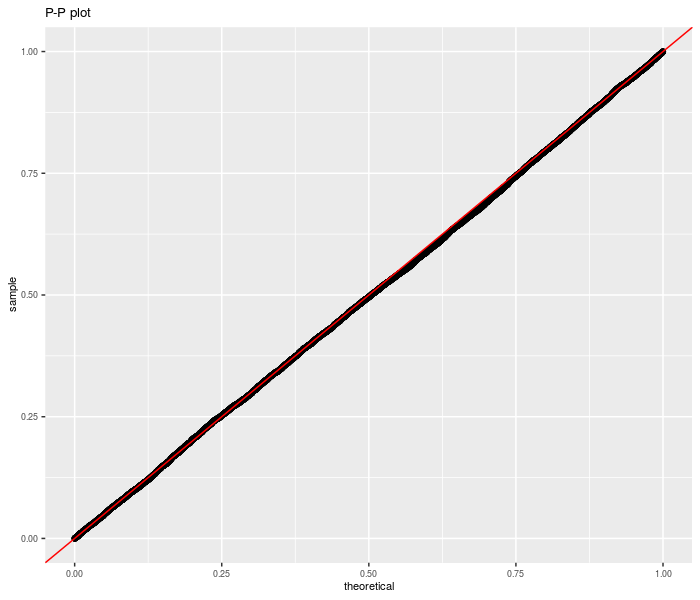

# SharpeR

[](https://github.com/shabbychef/SharpeR/actions)
[](https://codecov.io/github/shabbychef/SharpeR?branch=master)
[](https://cran.r-project.org/package=SharpeR)
[](https://www.r-pkg.org/pkg/SharpeR)
[](https://www.r-pkg.org/pkg/SharpeR)

A number of utilities for dealing with Sharpe ratio, the Sharpe ratio of the
Markowitz portfolio, and, in general, overfit of trading strategies based on
(in-sample) Sharpe statistics.

-- Steven E. Pav, shabbychef@gmail.com

## Installation

This package may be installed from CRAN; the latest development version may be
installed via [drat](https://github.com/eddelbuettel/drat "drat"), or built from
[github](https://github.com/shabbychef/SharpeR "SharpeR"):


```r
# install via CRAN:
install.packages("SharpeR")

# get latest dev release via drat:
if (require(drat)) {
    drat:::add("shabbychef")
    install.packages("SharpeR")
}

# get snapshot from github (may be buggy)
if (require(devtools)) {
    install_github("shabbychef/SharpeR")
}
```

# Basic Usage

## Using sr


```r
require(SharpeR)
# suppose you computed the Sharpe of your strategy
# to be 1.3 / sqrt(yr), based on 1200 daily
# observations.  an object can be instanatiated as
# follows
my.sr <- sr(sr = 1.3, df = 1200 - 1, ope = 252, epoch = "yr")
print(my.sr)
```

```
##        SR/sqrt(yr) Std. Error t value Pr(>t)   
## Sharpe        1.30       0.46     2.8 0.0023 **
## ---
## Signif. codes:  0 '***' 0.001 '**' 0.01 '*' 0.05 '.' 0.1 ' ' 1
```

And using real data:

```r
require(quantmod)
options(getSymbols.warning4.0 = FALSE)

# get price data, compute log returns on adjusted
# closes
get.ret <- function(sym, warnings = FALSE, ...) {
    # getSymbols.yahoo will barf sometimes; do a
    # trycatch
    trynum <- 0
    while (!exists("OHCLV") && (trynum < 7)) {
        trynum <- trynum + 1
        try(OHLCV <- getSymbols(sym, auto.assign = FALSE, 
            warnings = warnings, ...), silent = TRUE)
    }
    adj.names <- paste(c(sym, "Adjusted"), collapse = ".", 
        sep = "")
    if (adj.names %in% colnames(OHLCV)) {
        adj.close <- OHLCV[, adj.names]
    } else {
        # for DJIA from FRED, say.
        adj.close <- OHLCV[, sym]
    }
    rm(OHLCV)
    # rename it
    colnames(adj.close) <- c(sym)
    adj.close <- adj.close[!is.na(adj.close)]
    lrets <- diff(log(adj.close))
    # chop first
    lrets[-1, ]
}
get.rets <- function(syms, ...) {
    some.rets <- do.call("cbind", lapply(syms, get.ret, 
        ...))
}
```


```r
some.rets <- get.rets(c("IBM", "AAPL", "XOM"), from = "2004-01-01", 
    to = "2013-08-01")
print(as.sr(some.rets))
```

```
##      SR/sqrt(yr) Std. Error t value  Pr(>t)    
## IBM         0.43       0.32     1.3 0.09045 .  
## AAPL        1.05       0.32     3.2 0.00058 ***
## XOM         0.43       0.32     1.3 0.09366 .  
## ---
## Signif. codes:  0 '***' 0.001 '**' 0.01 '*' 0.05 '.' 0.1 ' ' 1
```

## Unpaired test for Sharpe Ratio

A single equation on multiple signal-noise ratios with independent samples
can be computed using the `sr_unpaired_test` function. This code performs
inference via the asymptotic expansion of the Sharpe ratio.
The `sr_test` also acts as a frontend for this code, for the two sample
case.

First we perform this test under the null, using randomly generated data.
We are testing the sum of three differences of Sharpes here.

```r
set.seed(9001)
pvals <- replicate(10000L, {
    X <- matrix(rnorm(500 * 6), ncol = 6)
    inp <- as.sr(X)
    etc <- sr_unpaired_test(inp)
    etc$p.value
})
library(ggplot2)

data <- data.frame(pvals = pvals)
# empirical CDF of the p-values; should be uniform
ph <- ggplot(data, aes(sample = pvals)) + stat_qq(distribution = stats::qunif) + 
    geom_abline(slope = 1, intercept = 0, colour = "red") + 
    theme(text = element_text(size = 8)) + labs(title = "P-P plot")

print(ph)
```


Now we repeat for non-zero null value:

```r
set.seed(9002)
pvals <- replicate(10000L, {
    zeta <- 0.1
    sg <- 0.01
    X <- matrix(rnorm(500 * 6, mean = zeta * sg, sd = sg), 
        ncol = 6)
    inp <- as.sr(X)
    etc <- sr_unpaired_test(inp, contrasts = rep(1, 
        dim(X)[2]), null.value = dim(X)[2] * zeta)
    etc$p.value
})
require(ggplot2)

data <- data.frame(pvals = pvals)
# empirical CDF of the p-values; should be uniform
ph <- ggplot(data, aes(sample = pvals)) + stat_qq(distribution = stats::qunif) + 
    geom_abline(slope = 1, intercept = 0, colour = "red") + 
    theme(text = element_text(size = 8)) + labs(title = "P-P plot")

print(ph)
```



Now for real data.  We take monthly returns of the three Fama French factors plus momentum 
(the original Fifth Beatle), then divide into January and non-January periods. We regress
Momentum against the other three factors, then convert the linear regression to a Sharpe ratio
estimate. The two Sharpe ratios are then thrown into an unpaired sample test. We reject the null
of equal idiosyncratic momentum in January versus the rest of the year at the 0.05 level.
Is this 'the January Effect'? Perhaps.


```r
library(xts)
if (!require(tsrsa)) {
    devtools::install_github("shabbychef/tsrsa")
    library(tsrsa)
}

data("mff4", package = "tsrsa")

# January or not
is.jan <- months(index(mff4)) == "January"

# perform linear regression
mod.jan <- lm(UMD ~ Mkt + SMB + HML, data = mff4[is.jan, 
    ])
mod.rem <- lm(UMD ~ Mkt + SMB + HML, data = mff4[!is.jan, 
    ])

# convert lm models to Sharpes
sr.jan <- as.sr(mod.jan)
sr.rem <- as.sr(mod.rem)

# perform unpaired test
etc <- sr_unpaired_test(list(sr.jan, sr.rem), contrasts = c(1, 
    -1), null.value = 0, ope = 12)
print(etc)
```

```
## 
## 	unpaired k-sample sr-test
## 
## data:  list(sr.jan, sr.rem)
## Wald statistic = -3, df = 90, p-value = 0.004
## alternative hypothesis: true weighted sum of signal-noise ratios is not equal to 0
## 95 percent confidence interval:
##  -0.88  0.88
## sample estimates:
## equation on Sharpe ratios 
##                      -1.3
```

## Prediction Intervals

By inflating standard errors, we can
compute prediction intervals for future realized Sharpe ratio, with coverage
frequency over the full experiment. Here is an example on fake data:


```r
set.seed(9003)
n1 <- 500
n2 <- 100
okvals <- replicate(500, {
    zeta <- 0.1
    sg <- 0.01
    X <- rnorm(n1 + n2, mean = zeta * sg, sd = sg)
    inp <- as.sr(X[1:n1])
    oos <- as.sr(X[n1 + (1:n2)])
    
    pint <- predint(inp, oosdf = n2 - 1, ope = 1)
    is.ok <- (pint[, 1] <= oos$sr) & (oos$sr <= pint[, 
        2])
    is.ok
})
coverage <- mean(okvals)
print(coverage)
```

```
## [1] 0.95
```


For a more complicated example, consider the 'Sharpe' under the attribution
model. Here we use the _daily_ data of the three Fama French factors, then
perform an attribution of SMB against the market and HML. We compute the
factor model Sharpe for the first nine months of each year, and of the last three
months separately. Using the first three quarters, we compute a prediction interval 
for the fourth quarter, then check coverage:


```r
library(xts)
if (!require(tsrsa)) {
    devtools::install_github("shabbychef/tsrsa")
    library(tsrsa)
}

data("dff4", package = "tsrsa")
dff4 <- dff4["1927-01-01::"]

# shoot me if this is how to get the year number
# from a time index.
yrno <- as.numeric(floor(as.yearmon(index(dff4))))
qname <- quarters(index(dff4))

is.q4 <- (qname == "Q4")

okvals <- lapply(unique(yrno), function(yr) {
    isi <- (yrno == yr) & !is.q4
    oosi <- (yrno == yr) & is.q4
    mod.is <- lm(SMB ~ Mkt + HML, data = dff4[isi, 
        ])
    mod.oos <- lm(SMB ~ Mkt + HML, data = dff4[oosi, 
        ])
    sr.is <- as.sr(mod.is)
    sr.oos <- as.sr(mod.oos)
    # compute prediction intervals
    pint <- predint(sr.is, oosdf = sr.oos$df, oosrescal = sr.oos$rescal, 
        ope = sr.oos$ope)
    is.ok <- (pint[, 1] <= sr.oos$sr) & (sr.oos$sr <= 
        pint[, 2])
    is.ok
})
coverage <- mean(unlist(okvals))
print(coverage)
```

```
## [1] 0.79
```


It is not clear if non-normality or omitted variable bias (or broken code!) 
is to blame for the apparent conservatism of the prediction intervals in this case.
We can check by simply shuffling the monthly returns data and repeating the
experiment:


```r
# shuffle the returns data by row
set.seed(1234)
shufff <- as.data.frame(dff4)
shufff <- shufff[sample.int(nrow(shufff)), ]

okvals <- lapply(unique(yrno), function(yr) {
    isi <- (yrno == yr) & !is.q4
    oosi <- (yrno == yr) & is.q4
    mod.is <- lm(SMB ~ Mkt + HML, data = shufff[isi, 
        ])
    mod.oos <- lm(SMB ~ Mkt + HML, data = shufff[oosi, 
        ])
    sr.is <- as.sr(mod.is)
    sr.oos <- as.sr(mod.oos)
    # compute prediction intervals
    pint <- predint(sr.is, oosdf = sr.oos$df, oosrescal = sr.oos$rescal, 
        ope = sr.oos$ope)
    is.ok <- (pint[, 1] <= sr.oos$sr) & (sr.oos$sr <= 
        pint[, 2])
    is.ok
})
coverage <- mean(unlist(okvals))
print(coverage)
```

```
## [1] 0.94
```

Of course, this could be a 'lucky seed', but one suspects that non-normality is _not_
the issue, rather there is some autocorrelation of (idiosyncratic) returns (or volatility!).

## Inference on the Markowitz Portfolio

The (negative) Markowitz portfolio appears in the inverse of
the uncentered second moment matrix of the 'augmented' vector
of returns. Via the Central Limit Theorem and the delta method
the asymptotic distribution of the Markowitz portfolio can
be found. From this, Wald statistics on the individual portfolio
weights can be computed. Here I perform this computation on the
portfolio consisting of three large cap stocks, and find
that the Markowitz weighting of AAPL is significantly non-zero
(modulo the selection biases in universe construction). The
results are little changed when using a 'robust' covariance
estimator.


```r
some.rets <- get.rets(c("IBM", "AAPL", "XOM"), from = "2004-01-01", 
    to = "2013-08-01")

ism.wald <- function(X, vcov.func = vcov) {
    # negating returns is idiomatic to get + Markowitz
    ism <- ism_vcov(-as.matrix(X), vcov.func = vcov.func)
    ism.mu <- ism$mu[1:ism$p]
    ism.Sg <- ism$Ohat[1:ism$p, 1:ism$p]
    retval <- ism.mu/sqrt(diag(ism.Sg))
    dim(retval) <- c(ism$p, 1)
    rownames(retval) <- rownames(ism$mu)[1:ism$p]
    return(retval)
}

wald.stats <- ism.wald(some.rets)
print(t(wald.stats))
```

```
##        IBM AAPL  XOM
## [1,] -0.23  2.9 0.17
```

```r
if (require(sandwich)) {
    wald.stats <- ism.wald(some.rets, vcov.func = sandwich::vcovHAC)
    print(t(wald.stats))
}
```

```
##        IBM AAPL  XOM
## [1,] -0.22  2.8 0.18
```
